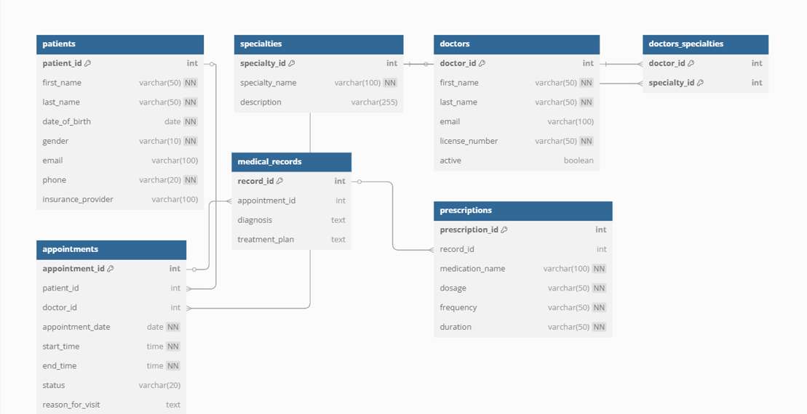

Clinic Booking System

Project overview

The Clinic Booking System is a database solution designed to manage medical appointments, patient records, and clinic operations efficiently. This system is suitable for small to medium-sized medical clinics and doctors' offices.

Features

Manage patient profiles and information
Track doctor credentials and specialties
Schedule, modify, and cancel appointments
Record medical diagnoses and treatments
Manage medication prescriptions
Find available doctors by specialty

Database Schema

Tables

patients - Stores patient information
doctors - Contains doctor profiles
specialties - Lists medical specialties
doctors_specialties - Maps doctors to specialties (many-to-many)
appointments - Records all appointment details
medical_records - Stores diagnoses and treatment plans
prescriptions - Contains medication details

Entity Relationship Diagram (ERD)

